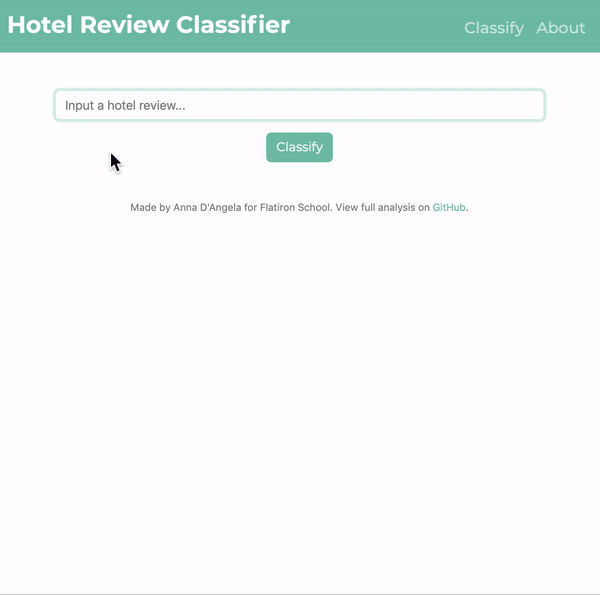
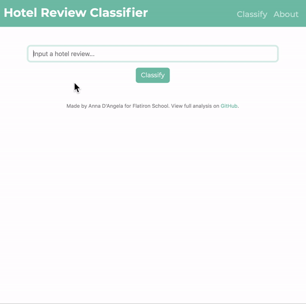

Anna D'Angela

Flatiron Data Science Program

Module 5 Project - Capstone

*An extension to my [mod05-capstone-NLP](https://github.com/anna-dang/mod05-capstone-NLP) project. Please see that repository for my full analysis and methodology.*

---

## Hotel Review Classifier App

*Natural Language Processing (NLP) - Communication Management Tool*

---

### Overview
For the hospitality industry, reputation is everything. Guests book based on online presence and word-of-mouth.
Negative reviews can largely impact the booking decisions of future guests. For negative guest experiences, time and care are crucial for guest recovery. Finding and attending to an unhappy guest before they post a review can change their experience, and their score.

**Stakeholder:** Denver based hospitality software company

**End User:** Hotel industry guest service managers

**Business Problem:** Reach dissatisfied guests quickly to increase customer retention

**Business Solution:**  Build a communication management tool to flag dissatisfied guests for rapid recovery by staff

---

### Heroku App

Follow this link to connect to the Hotel Review Classifier [Heroku App](https://dangela-review-app.herokuapp.com/predict) developed from this project (app may take a few moments to load). The app will function as a demonstration of how the communication tool will perform.

Input a hotel review and click 'Classify'. The app will return a 'flag' or 'pass' status. Meaning: whether the review is 'flagged' for immediate guest recovery or if it 'passes' and can be left for regular attention. The app also returns a predicted review numerical score.

#### Positive Demo

#### Negative Demo

 
---

### Skills Demonstrated

App Hosting: Heroku

Front-End App: HTML, CSS, Boostrap

Back-End APP: Python, Flask

Classification: Sci-Kit Learn NLP pipelines

---

### Thank you!

See my complete analysis and how I built he models in my [mod05-capstone-NLP](https://github.com/anna-dang/mod05-capstone-NLP) repo.

Please view my [presentation](https://docs.google.com/presentation/d/1RRYsUs9rEWzMNWBq15tbA3YPxuJFMx6x2mFG-c_z_z4/present?slide=id.gb40562cf50_0_345) and [blog](https://annadangela.medium.com/) for this project.

Connect with me on [LinkedIn](https://www.linkedin.com/in/anna-d-angela-216b01b2/) and [Twitter](https://twitter.com/_dangelaa)!
